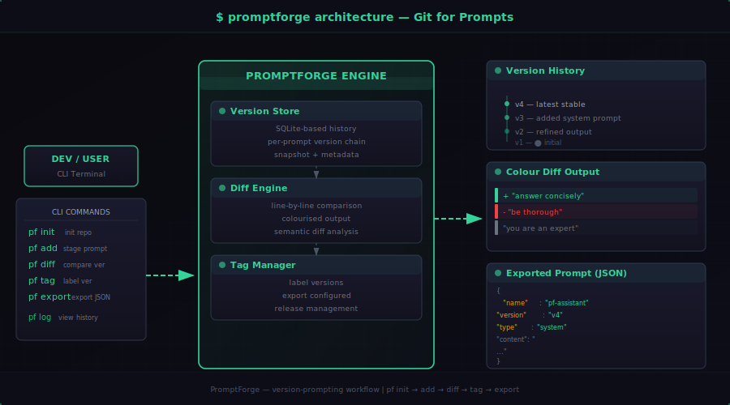

# PromptForge — Git for Prompts

**Version, diff, tag, and deploy AI prompts like code.**

---

> **⚠️ This is a public bridge repository.** The full source code, issue tracker, and development activity live in the private [`narko4u/PromptForge-Core`](https://github.com/narko4u/PromptForge-Core) repository. This repo serves as the public-facing entry point.

---

PromptForge is a CLI utility for developers and AI engineers who manage multiple prompts across projects. Stop storing prompts in text files, Notion docs, or hardcoded strings. PromptForge gives you version control, diff, tagging, and export — all offline, all local, no signup required.

## Features

- **Version control** — Every change creates a new version. Never lose track of "what was that prompt before I changed it?"
- **Diff** — See exactly what changed between versions. Coloured output.
- **Tagging** — Organise prompts by purpose (system, user, RAG, etc.)
- **Export** — Export any version to a clean Markdown file for review or deployment.
- **100% local** — SQLite storage. No cloud, no API, no telemetry. Your prompts never leave your machine.
- **Zero dependencies** — Pure Python stdlib + yaml. Works on any Python 3.9+ system.

## Install

```bash
pip install promptforge
```

Or install from source:

```bash
git clone https://github.com/narko4u/PromptForge.git
cd PromptForge
pip install -e .
```

## Quick Start

```bash
# Initialize
pf init

# Add a prompt
pf add system-prompt --file my-prompt.txt

# List all prompts
pf list

# Show the latest version
pf show system-prompt

# Update with a new version
pf update system-prompt --file updated-prompt.txt

# See what changed
pf diff system-prompt 1 2

# Export for review
pf export system-prompt --output review.md

# See version history
pf history system-prompt
```

## Commands

| Command | Description |
|---------|-------------|
| `pf init` | Initialize PromptForge in current directory |
| `pf add <name>` | Add a new prompt (from file or stdin) |
| `pf list` | List all prompts |
| `pf show <name>` | Show latest (or specific) version |
| `pf update <name>` | Add a new version of an existing prompt |
| `pf diff <name> <v1> <v2>` | Show diff between two versions |
| `pf export <name>` | Export prompt to file |
| `pf history <name>` | Show version history |
| `pf import` | Batch import from a prompts/ directory |

## Architecture



PromptForge stores prompt data in a local `.promptforge/` directory. Every command flows through a simple pipeline:

```
Developer CLI
    │
    ├── pf init     ──▶  Creates .promptforge/ repo
    ├── pf add      ──▶  Version Store (SQLite)
    ├── pf diff     ──▶  Diff Engine (line-by-line)
    ├── pf tag      ──▶  Tag Manager (labels)
    └── pf export   ──▶  JSON output

         ┌─────────────────────┐
         │   .promptforge/     │
         │                     │
         │  ┌───────────────┐  │
         │  │ Version Store │  │
         │  │  (SQLite DB)  │  │
         │  │  v1 → v2 → v3 │  │
         │  └───────┬───────┘  │
         │          │          │
         │  ┌───────▼───────┐  │
         │  │  Diff Engine  │  │
         │  │  comparison   │  │
         │  └───────┬───────┘  │
         │          │          │
         │  ┌───────▼───────┐  │
         │  │ Tag Manager   │  │
         │  │ label+export  │  │
         │  └───────────────┘  │
         └─────────────────────┘
```

## Source Code

The full source code for PromptForge is maintained in the **private** [`narko4u/PromptForge-Core`](https://github.com/narko4u/PromptForge-Core) repository. This public repo provides documentation, issue tracking, and community engagement.

## Use Cases

- **AI engineers** — Version your system prompts, user prompts, and RAG templates
- **Teams** — Share prompt files via git (prompts live in your repo as `.md` files)
- **Indie hackers** — Track prompt iterations across your AI product
- **Researchers** — Keep reproducible prompt chains for experiments

## License

MIT — free for personal and commercial use.

Built by [Empire Labs](https://github.com/narko4u).
